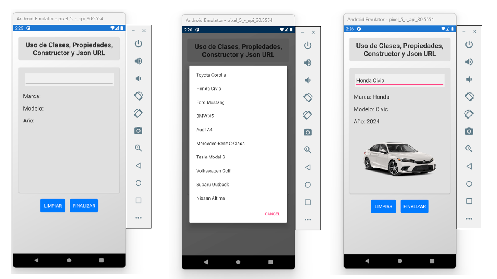
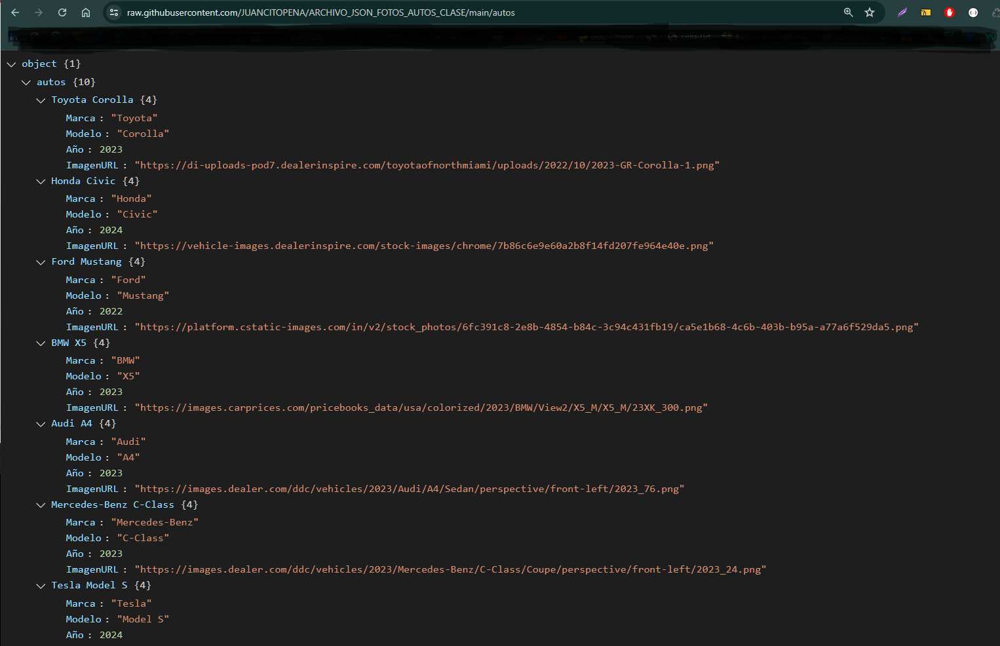

# AutosApp2: Aplicación Interactiva de Información de Autos



autos_json
## Descripción

AutosApp2 es una aplicación Xamarin.Forms que demuestra el uso de clases, propiedades, constructores y recuperación de datos JSON desde una URL. Esta aplicación proporciona una interfaz interactiva para que los usuarios exploren información sobre varios modelos de autos.

## Características

- Menú desplegable para seleccionar diferentes modelos de autos
- Visualización de detalles del auto incluyendo marca, modelo y año
- Visualización de imagen del auto seleccionado
- Recuperación de datos desde un archivo JSON remoto
- Interfaz de usuario limpia e intuitiva con fondo degradado
- Opciones para limpiar selecciones y salir de la aplicación

## Aspectos Técnicos Destacados

1. **Diseño de UI en XAML:**
   - Utiliza XAML para crear una interfaz de usuario responsiva y visualmente atractiva
   - Implementa estilos y recursos personalizados para un diseño consistente
   - Usa un fondo degradado para mejorar el atractivo visual

2. **Backend en C#:**
   - Implementa la clase `Auto` para representar objetos de autos
   - Utiliza programación asíncrona para la carga de datos
   - Maneja la deserialización JSON usando Newtonsoft.Json
   - 


3. **Gestión de Datos:**
   - Recupera datos de autos desde un archivo JSON remoto
   - Almacena información de autos en un Diccionario para un acceso eficiente
   - Actualiza dinámicamente la UI basada en las selecciones del usuario

4. **Interacción del Usuario:**
   - Proporciona elementos interactivos como un Picker para la selección de autos
   - Implementa manejadores de eventos para las acciones del usuario
   - Ofrece opciones para limpiar selecciones y salir de la aplicación

## Cómo Funciona

1. Al iniciar, la aplicación carga datos de autos desde un archivo JSON remoto.
2. Los usuarios pueden seleccionar un modelo de auto del menú desplegable.
3. Al seleccionar, la aplicación muestra los detalles del auto y una imagen.
4. Los usuarios pueden limpiar su selección o salir de la aplicación usando los botones proporcionados.

## Propósito

Esta aplicación sirve como una demostración de:
- Construcción de interfaces de usuario con Xamarin.Forms y XAML
- Implementación de conceptos de programación orientada a objetos en C#
- Manejo de recuperación de datos remotos y análisis JSON
- Creación de una aplicación móvil interactiva y responsiva

## Público Objetivo

Este proyecto es ideal para:
- Desarrolladores de Xamarin.Forms principiantes a intermedios
- Estudiantes aprendiendo sobre desarrollo de aplicaciones móviles
- Cualquiera interesado en ver un ejemplo práctico de C# y XAML en acción

## Cómo Clonar el Repositorio

Para clonar este repositorio y ejecutar el proyecto en tu máquina local, sigue estos pasos:

1. Abre una terminal o línea de comandos.
2. Navega al directorio donde deseas clonar el repositorio.
3. Ejecuta el siguiente comando:

```
git clone https://github.com/tu-usuario/AutosApp2.git
```

4. Navega al directorio del proyecto:

```
cd AutosApp2
```

5. Abre la solución en Visual Studio o tu IDE preferido para Xamarin.Forms.

## Como Crear el Proyecto desde Cero: 

Esta guía te ayudará a crear una aplicación Xamarin.Forms llamada `AutosApp2`, que muestra información de autos desde un archivo JSON alojado en una URL y permite cerrar la aplicación mediante un botón.

## Requisitos Previos

- Visual Studio con el workload de desarrollo móvil .NET instalado.
- Conocimiento básico de C# y Xamarin.Forms.

## Pasos para Crear la Aplicación

### 1. Crear un Nuevo Proyecto Xamarin.Forms

1. Abre Visual Studio.
2. Selecciona **Crear un nuevo proyecto**.
3. Busca y selecciona **Aplicación Móvil con Xamarin.Forms**.
4. Asigna el nombre del proyecto como `AutosApp2`.
5. Elige una ubicación para guardar el proyecto y haz clic en **Crear**.
6. Selecciona **Plantilla en blanco** y asegúrate de que la plataforma de destino sea **Android y iOS**.
7. Haz clic en **Crear**.

## Configurar el Archivo `MainPage.xaml`

### 1. Crea un diseño básico en `MainPage.xaml`

Aquí está el diseño básico de la página principal de la aplicación:

### 2 Configura el archivo `MainPage.xaml.cs`

En el archivo `MainPage.xaml.cs`, añade la lógica para cargar los datos desde la URL y manejar los eventos de los botones.

## 4. Ejecutar la Aplicación

Conecta un dispositivo Android o utiliza un emulador.
Selecciona la plataforma Android en Visual Studio.
Haz clic en Ejecutar para compilar y ejecutar la aplicación.

## 5. Usar la Aplicación

Selecciona un auto en el Picker para ver su información.
Presiona el botón Limpiar para restablecer los campos.
Presiona el botón Finalizar para cerrar la aplicación.
¡Y eso es todo! Ahora tienes una aplicación funcional que carga datos desde una URL y permite cerrar la aplicación desde un botón.

## Licencia

Este proyecto está licenciado bajo la Licencia MIT. Consulta el archivo [LICENSE](LICENSE) para más detalles.

## ¡Apoya este Proyecto!

Si encuentras útil este proyecto, por favor considera:

- ⭐ Darle una estrella en GitHub
- 🔗 Compartirlo con otros desarrolladores
- 🐛 Reportar problemas o sugerir mejoras
- 🍴 Hacer un fork y contribuir al proyecto

### Tu apoyo es muy apreciado y nos ayuda a seguir mejorando.

### ¡Siéntete libre de explorar, modificar y aprender de este proyecto!
